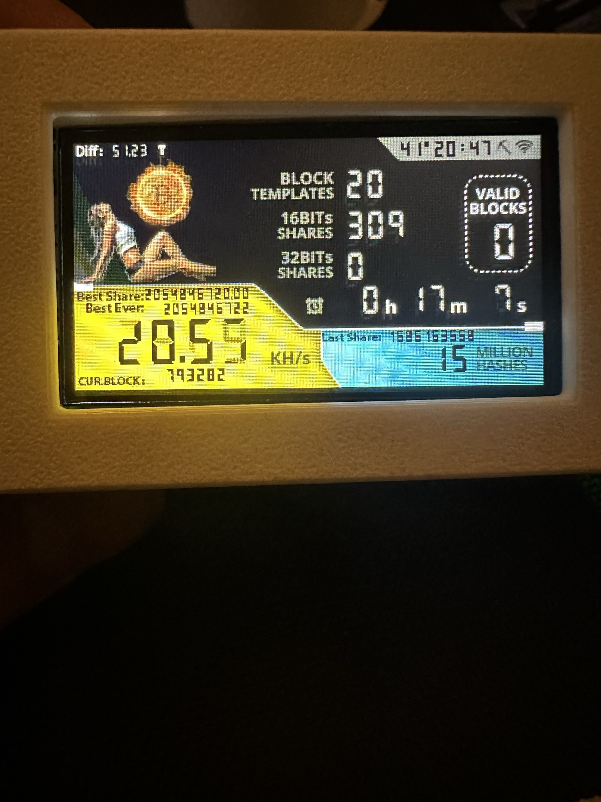

# NerdSoloMiner
**The NerdSoloMiner v2.1**

## NEWS
- It is now possible to change the appearance by quickly double-clicking the upper button (USB-C on the right side). 
  Additionally, the "current Block," "Last Share," "Best Ever," "Best Share," and the "Diff" are displayed.

This is a **free and open source project** that let you try to reach a bitcoin block with a small piece of hardware. 

The main aim of this project is to let you **learn more about minery** and to have a beautiful piece of hardware in your desktop.

Original project https://github.com/valerio-vaccaro/HAN

## Requirements
- TTGO T-Display S3
- 3D BOX [here](3d_files/)

### Project description
**ESP32 implementing Stratum protocol** to mine on solo pool. Pool can be changed but originally works with ckpool.

This project is using ESP32-S3, uses WifiManager to modify miner settings and save them to SPIFF. 

This miner is multicore and multithreads, each thread mine a different block template. After 1,000,000 trials the block in refreshed in order to avoid mining on old template.

***Current project is still in developement and more features will be added***

## Build Tutorial
### Hardware requirements
- TTGO T-Display S3 > Buy it on aliexpress or amazon
- 3D BOX
- fan (optional)

### Flash firmware
Create your own miner.
If you want you can compile the entire project using VSCode, Arduino, PlatformIO or Expressif IDF.

1. Download and install VSCode.
2. Go to GitHub and navigate to the repository with the code you want to download.
3. Click on the green "Code" button to download the entire codebase.
4. Open VSCode and navigate to the folder where you downloaded the code.
5. In the top-right corner of VSCode, click on the small downward arrow and select "Upload."
6. Wait for the code to finish uploading.

### NerdMiner configuration
After programming, you will only need to setup your Wifi and BTC address.

1. Connect to NerdMinerAP
    - AP:   NerdMinerAP
    - PASS: MineYourCoins
2. Setup your Wifi Network
3. Add your BTCaddress

Optional you can select other pool:

| Pool URL                 | Port | URL |
|---                       |---   |---  | 
| solo.ckpool.org          | 3333 | https://solo.ckpool.org/ |  At the moment, only ckpool supports Last Share, Best Share and Best Ever !!!
| btc.zsolo.bid            | 6057 | https://zsolo.bid/en/btc-solo-mining-pool |
| eu.stratum.slushpool.com | 3333 | https://braiins.com/pool |

### Buttons
With the USB-C port to the right:
- The top button allows you to **reset the configurations and reboot** your NerdMiner. Just hold it for 5 seconds.
- Click the bottom button once to turn the screen off and on again
- Double click the bottom button to change the orientation (default is USB-C to the right)
- It is now possible to change the appearance by quickly double-clicking the upper button.

## Developers
### Project guidelines
- Current project was addapted to work with PlatformIO
- Current project works with ESP32-S3 but any ESP32 can be used.
- Partition squeme should be build as huge app
- All libraries needed shown on platform.ini

### On process
- [x]  Move project to platformIO
- [x]  Bug rectangle on screen when 1milion shares
- [x]  Bug memory leaks
- [x]  Bug Reboots when received JSON contains some null values
- [x]  Implement midstate sha256
- [x]  Bug Wificlient DNS unresolved on Wifi.h
- [ ]  Code refactoring
- [x]  Add blockHeight to screen
- [x]  Add clock to show current time
- [x]  Add new screen with global mining stats
- [ ]  Add support to control BM1397
- [x]  Page switch. 

### Donations/Project contributions
If you would like to help me here my btc bc1qp5a7hzgdm0p0qmzl0rts5z3c5cjmttz8cuxzgu :) Thanks

Enjoy